# 🏙️ OpenSourceWasteManagement


**OpenSourceWasteManagement** is an integrated platform designed to streamline urban management, civic engagement, and resource allocation. It bridges the gap between citizens and city administration by providing a robust ecosystem for incident reporting, task assignment, and AI-driven image analysis.

---

## ✨ Key Features

- **Role-Based Workflows**: Tailored interfaces for **Citizens** (reporting incidents), **Collectors/Workers** (managing tasks & schedules), and **Admins** (analytics & user management).
- **Incident & Announcement Management**: Real-time reporting of city incidents with dedicated announcement channels for civic updates.
- **AI-Powered Computer Vision**: Integrates **GroundingDINO** and **Segment Anything Model (SAM)** for advanced image segmentation and automated detection of urban issues.
- **Modern Tech Stack**: Lightning-fast backend powered by FastAPI, and a responsive frontend built with React & Vite.

---

## 📸 Screenshots

### 🛡️ Admin Dashboard
<details>
<summary><b>View Admin Interfaces</b> (Click to expand)</summary>
<p align="center">
  <b>Operations Overview</b><br>
  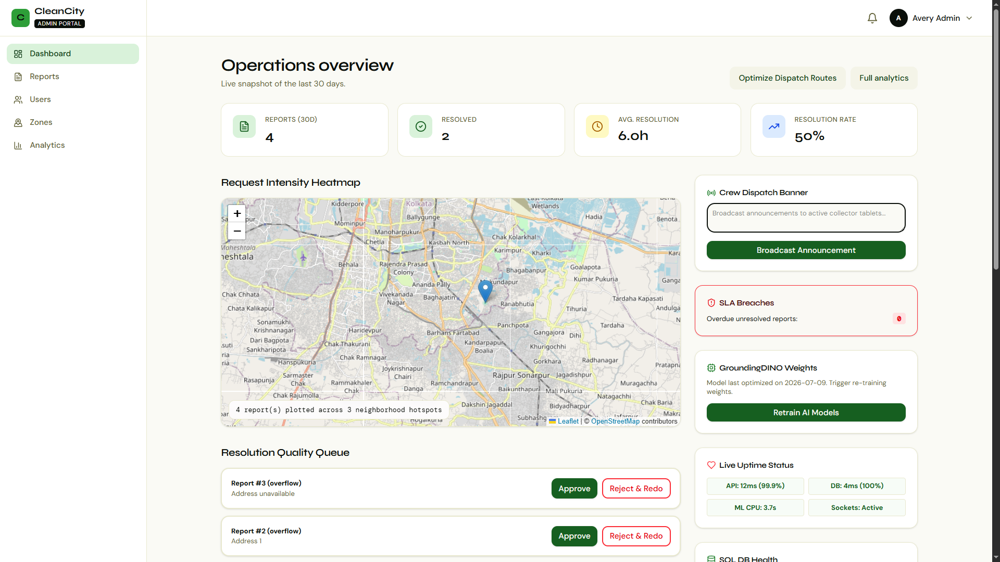
</p>
<p align="center">
  <b>Full Analytics</b><br>
  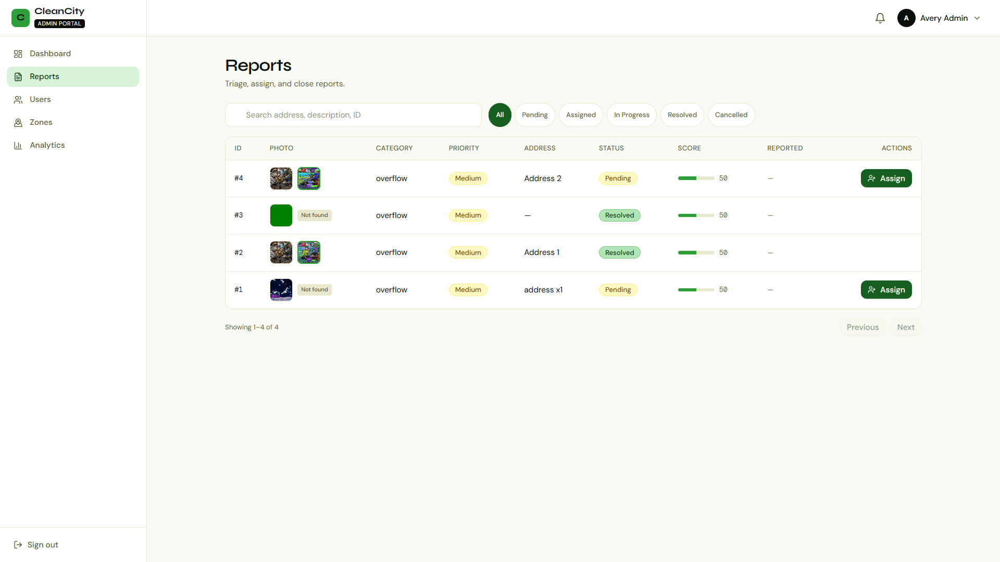
</p>
<p align="center">
  <b>User Management</b><br>
  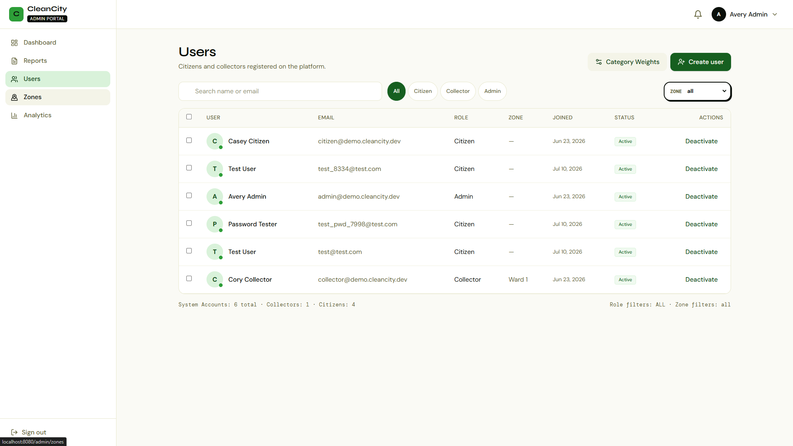
</p>
<p align="center">
  <b>Settings & Configurations</b><br>
  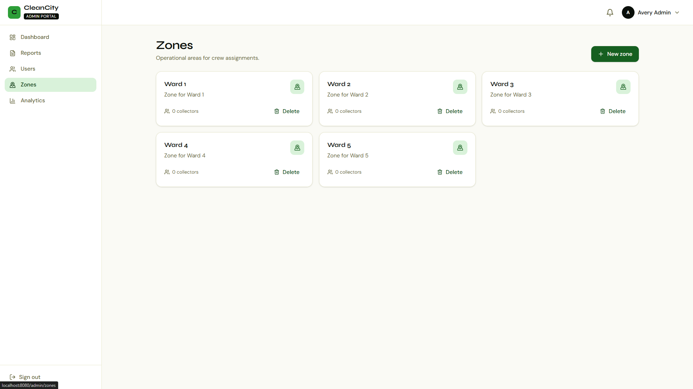
</p>
</details>

### 👤 Citizen Portal
<details>
<summary><b>View Citizen Interfaces</b> (Click to expand)</summary>
<p align="center">
  <b>Dashboard & Recent Activity</b><br>
  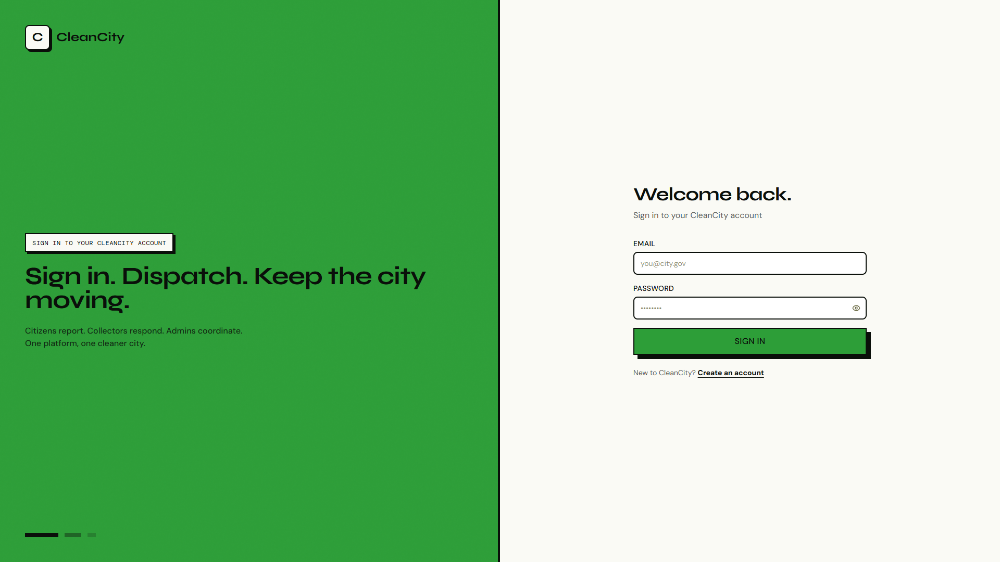
</p>
<p align="center">
  <b>New Report Form</b><br>
  
</p>
<p align="center">
  <b>My Reports & Status</b><br>
  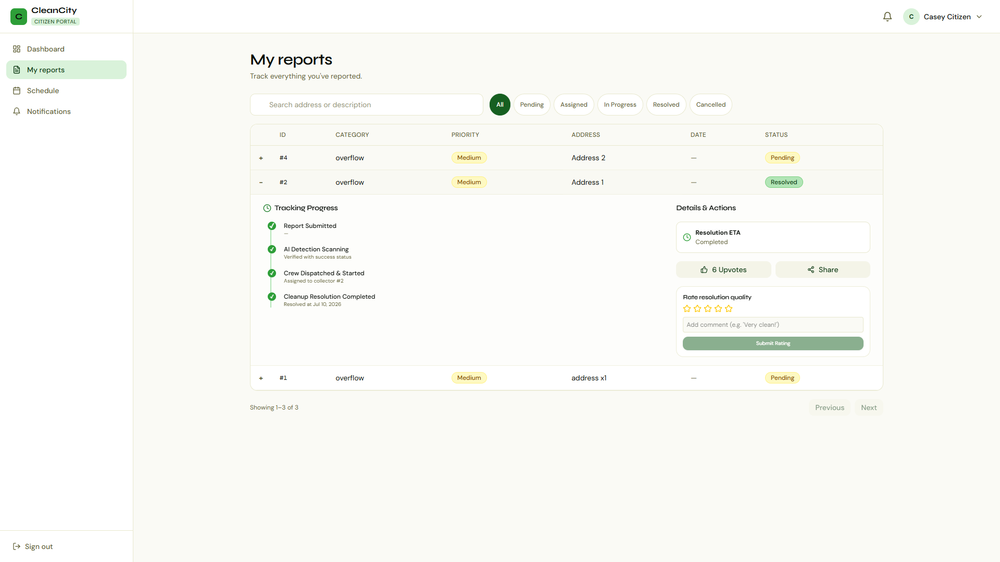
</p>
<p align="center">
  <b>Collection Schedule</b><br>
  
</p>
<p align="center">
  <b>Profile Settings</b><br>
  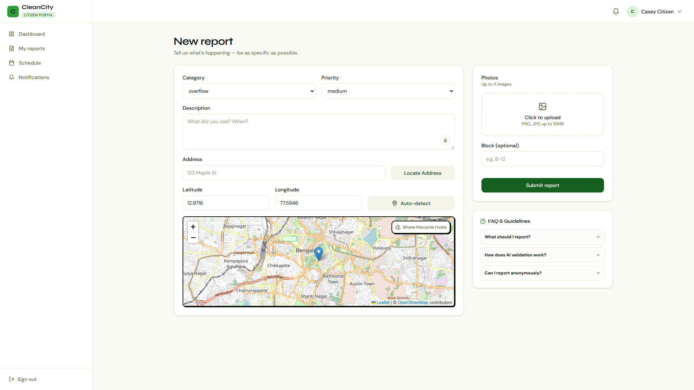
</p>
</details>

### 🚛 Collector View
<details>
<summary><b>View Collector Interfaces</b> (Click to expand)</summary>
<p align="center">
  <b>Dashboard & Assigned Tasks</b><br>
  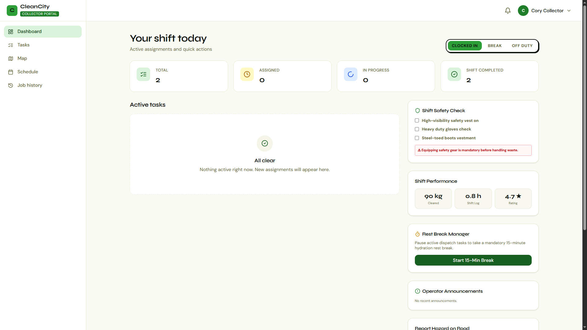
</p>
<p align="center">
  <b>Active Task Details</b><br>
  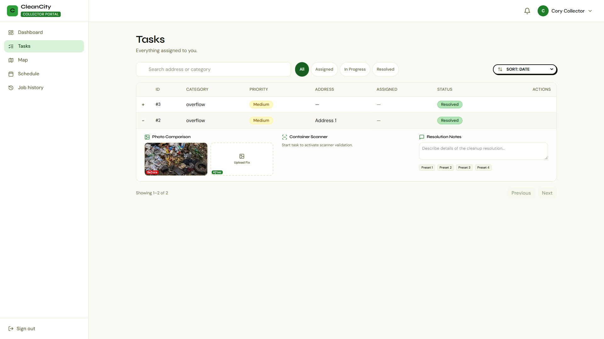
</p>
<p align="center">
  <b>Live Routing Map</b><br>
  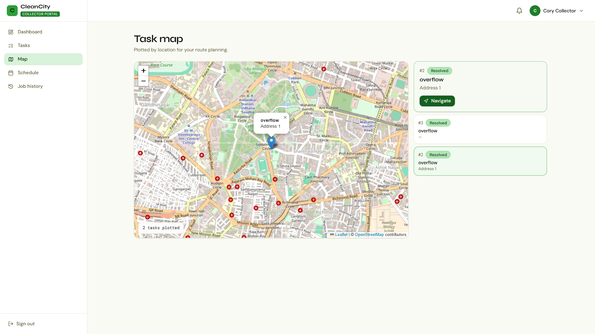
</p>
<p align="center">
  <b>Route Optimization</b><br>
  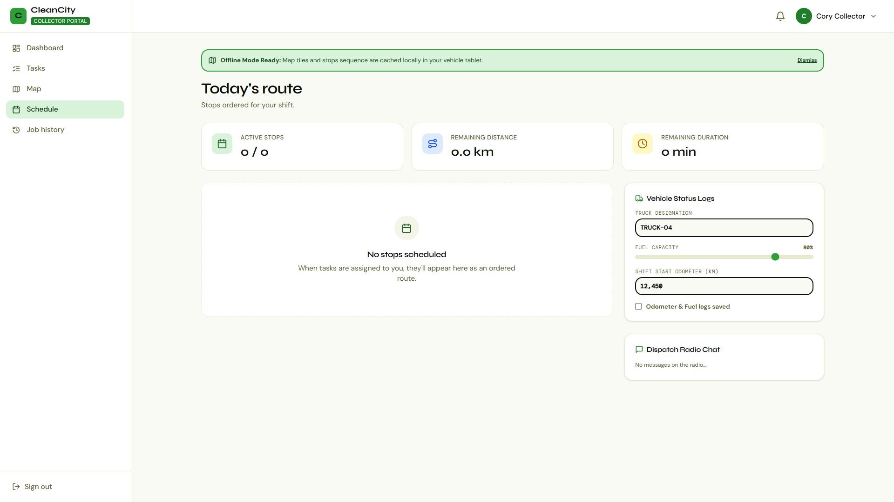
</p>
</details>

---

## 📂 Repository Structure

- `application/`: Contains the main web platform.
  - `src/`: React frontend (Vite + TypeScript).
  - `backend/`: Python FastAPI backend.
- `gDinoSam/`: Contains the GroundingDINO and SAM models for computer vision tasks.

---

## 🚀 Getting Started

### 1. The Frontend (React + Vite)

**Prerequisites**: [Node.js](https://nodejs.org/) and [Bun](https://bun.sh/) (or npm).

```bash
# 1. Navigate to the application directory
cd application

# 2. Install dependencies using Bun (recommended) or npm
bun install
# or: npm install

# 3. Start the development server
bun run dev
# or: npm run dev
```
*The frontend will be available at `http://localhost:5173`.*

### 2. The Backend (FastAPI)

**Prerequisites**: Python 3.9+.

```bash
# 1. Navigate to the backend directory
cd application/backend

# 2. Create and activate a virtual environment
# On Windows:
python -m venv venv
venv\Scripts\activate
# On macOS/Linux:
python -m venv venv
source venv/bin/activate

# 3. Install backend dependencies
pip install -r requirements.txt

# 4. Database Setup & Migrations
# Ensure you copy .env.example to .env and configure your database
alembic upgrade head

# 5. (Optional) Seed the database with demo users
python seed_demo_users.py

# 6. Run the FastAPI server
uvicorn app.main:app --reload
```
*The backend API will be available at `http://localhost:8000`.*

---

## 🧠 Setting up the Computer Vision Models (`gDinoSam/`)

The `gDinoSam` directory contains our advanced integration of GroundingDINO and SAM. 

### Environment Setup

```bash
# 1. Navigate to the model directory
cd gDinoSam

# 2. Create and activate a virtual environment
python -m venv venv
source venv/bin/activate  # (Use venv\Scripts\activate on Windows)

# 3. Install GroundingDINO and its dependencies
cd GroundingDINO
pip install -r requirements.txt
pip install -e .
```

### Downloading Model Weights

Due to size limits, model weights are not tracked in Git. You must download them manually to the `gDinoSam/GroundingDINO/weights/` folder.

```bash
# Create the weights directory
mkdir -p weights
cd weights

# Download GroundingDINO weights
wget -q https://github.com/IDEA-Research/GroundingDINO/releases/download/v0.1.0-alpha/groundingdino_swint_ogc.pth
```
**SAM Weights**: Download the SAM weights (e.g., SAM 2.1 Hiera Large) and place the `.pt` file in the same `weights` directory.
- Example: [Download SAM2.1 Hiera Large](https://dl.fbaipublicfiles.com/segment_anything_2/092824/sam2.1_hiera_large.pt)

### Running Inference

Once the environment is active and weights are loaded, run the demo script to process images from the `input/` folder and output results to `output/`:

```bash
python grounded_sam2_demo.py
```

---

## 🤝 Contributing

Contributions are always welcome! Please open an issue or submit a Pull Request to help improve the OpenSourceWasteManagement platform.

## 📄 License

This project is open-source and available under the [MIT License](LICENSE).

